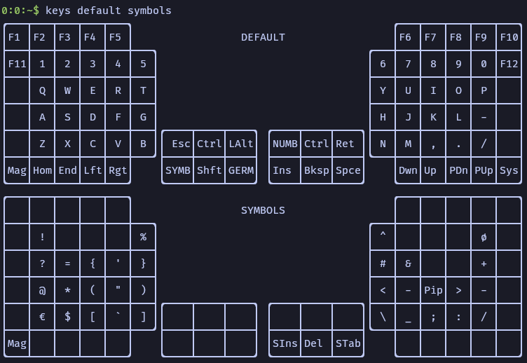

# Glove80 keymap cli

Read .keymap file for the glove80 and visualize the keyboard.



## Options

```bash
$ bin/keys --help
keys 
Keymap viewer for the glove80

USAGE:
    keys [OPTIONS] [FILTER]...

ARGS:
    <FILTER>...    One or multiple names of the layout to show. If no filter is specified, the
                   default layout will be shown. Can be substrings of the actual name (e.g. sym
                   for SYMBOLS)

OPTIONS:
    -f, --file <FILE>    Specify the .keymap file to read the layout [default:
                         ../config/config/glove80.keymap]
    -h, --help           Print help information
```

## Compile static bin

```bash
RUSTFLAGS="-Ctarget-feature=+crt-static" cargo build --target=x86_64-unknown-linux-gnu
mv ./target/x86_64-unknown-linux-gnu/debug/keys bin/keys
```

